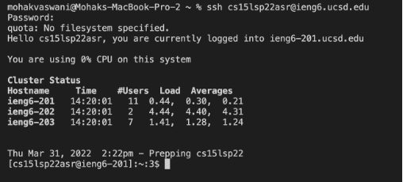
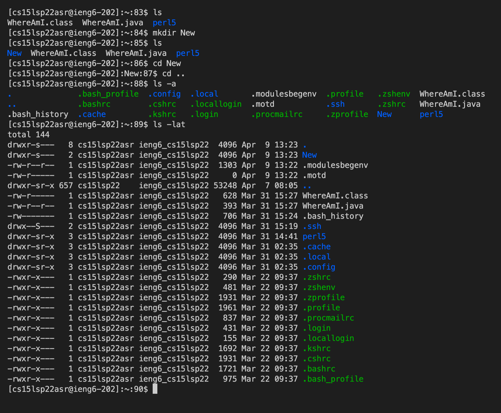
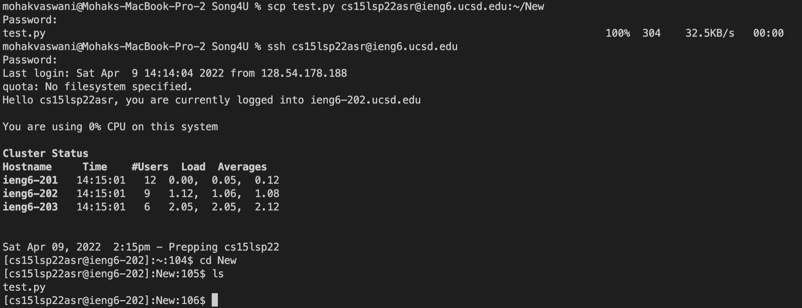
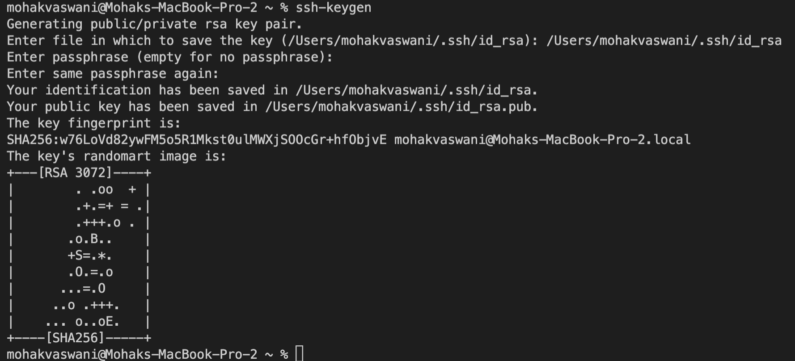
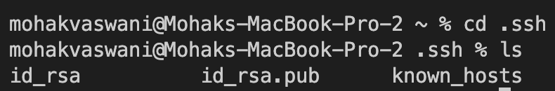
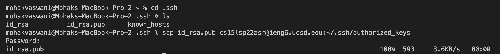
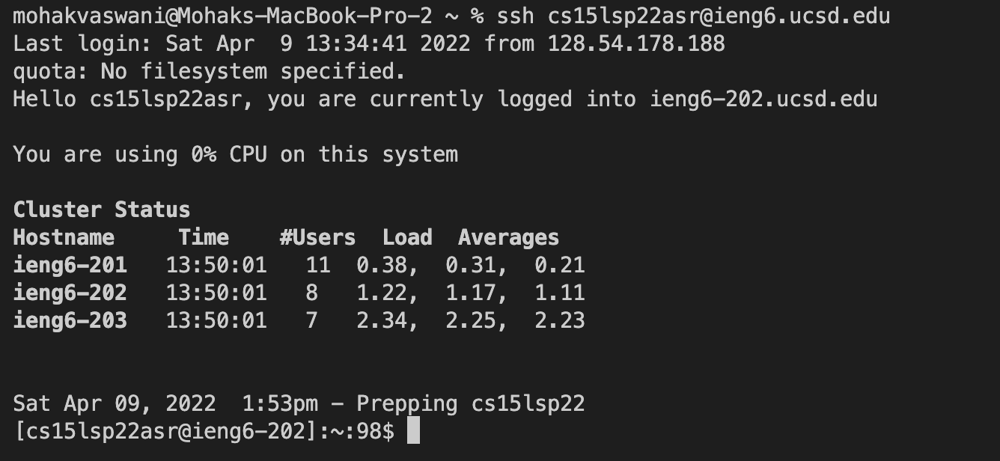
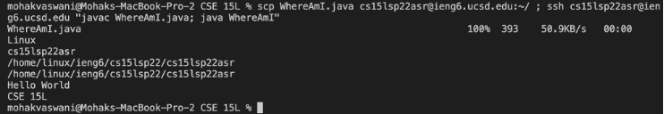

# Lab Report 1 - Week 2 - Mohak Vaswani

In this Lab Report, I am going to describe how we can log onto our course specific account _ieng6_ and run some basic **ssh** and **scp** commands. I am going to be describing 6 steps, with detailed description and screenshots for each step.

--------------------------------------------------------------------------------------------------------------

## _Step 1 - Installing VScode_

The first step is Installing VScode. You can download VScode at [this](https://code.visualstudio.com/download) link. 

Clicking the link will redirect you to the page to download VScode as per your operating system requirement.
Once downloaded, install and run VScode, and you should see a basic screen as shown:

--------------------------------------------------------------------------------------------------------------

## _Step 2 - Remotely Connecting_

# Step 2.1 - Finding your login details

Find your course specific account at [this](https://sdacs.ucsd.edu/~icc/index.php) link.

* Click on the link, it should prompt you to login with your student details
* Your account username should look something like `cs15lsp22zz` where `zz` are the unique character in your course specific account
* You might want to reset your password before you move forward which can be done through [this](./Lab-report-1-materials/How-to-Reset-your-Password.pdf) document.

# Step 2.2 - Opening a new terminal

Open up Visual Studio Code. On the toolbar at the top of your screen, you should see an option for **Terminal**. Click on it and select **New Terminal**. This will open up a new terminal on your VS code

# Step 2.3 - Connecting to Remote machine

* In your terminal, type the following command `ssh cs15lsp22zz@ieng6.ucsd.edu` and click enter
* If you are doing this for the first time, it will prompt you to verify the authenticity of the remote machine you are connecting to, type **yes** and press enter
* Now it will prompt you to enter your password (which you recently changes)
* After entering your password your screen should look as follows

--------------------------------------------------------------------------------------------------------------

## _Step 3 - Trying some commands_

Now let us try running some basic commands while we are connected to our remote machine. Some of the basic commands you can try are:
* `ls` --> Lists all files
* `cd <directory name>` --> Changes the directory to mentioned directory
* `ls -a` --> Lists all hidden files
* `cat <location/filename>` --> used to concatenate files

Following is a screenshot of me running some basic commands on my terminal

--------------------------------------------------------------------------------------------------------------

## _Step 4 - Moving files with scp_

You can transfer any file over to the remote machine using the **scp** command. This can be done in the following way : `scp <filename> cs15lsp22zz@ieng6.ucsd.edu`. It will prompt you to enter your password followed by transfer of file. You can even mention the directory you want to move it to on the remote machine by adding the location in front of the remote machine username. For example:
`scp <filename> cs15lsp22zz@ieng6.ucsd.edu/:~/test1`

Following attached is a screenshot of me transferring a file to a "New" Directory on my remote machine

--------------------------------------------------------------------------------------------------------------

## _Step 5 - Setting an ssh Key_

So far, we have had to enter our password every time we login into the remote machine using ssh or transfer a file using scp. This drastically increases the time for us to perform operations. One way to avoid this is to use public keys. The idea behind this is a program called **ssh-keygen**

# Step 5.1 - Generating public/private key pairs

* In your local machine's root directory, type the command `ssh-keygen`
* It will prompt you to enter the location where you want to store the keys, please enter the location given in the bracket.
* Then it will prompt you to add a paraphrase, please do input anything and press enter key. Similarly for the confirm paraphrase.
* This should generate two keys for you, public and private
* To confirm if these exists, type `cd .ssh` in your local-machines root directory followed by `ls`. You should see the two files as shown in the screenshot

Creating the keys:

Confirming they exist:

# Step 5.2 - Transferring the public key

* Log onto your remote machine and then list all hidden directories using `ls -a`. Check if the hidden directory **.ssh** exists or not. If not, create a **.ssh** directory using `mkdir .ssh`. Now log out of your remote machine.

* On your local machine, navigate to the folder containing your private and public key pairs. This is done by typing `cd .ssh` as we stored the keys in this hidden directory in the last step. List all the files in here and you should find **id_rsa.pub**

* Now type the following command in the terminal of your local machine 
`scp id_rsa.pub cs15lsp22zz@ieng6.ucsd.edu:~/.ssh/authorized_keys`

* Enter your password and the public key should be copied over to your remote machine as shown below

* Now if you try to login, it will not ask for a password as shown below

--------------------------------------------------------------------------------------------------------------

## _Step 6 - Optimizing Remote Running_

Some of the ways you can optimize your remote running experience are: 

* You can use the **up** or **down** arrow keys in your terminal to navigate to the most recent commands you made
* You can use the **tab** key to auto-complete the file-name/directory-name for you
* You can directly write a command at the end **ssh** command using **""** to directly run the command for you after logging in. For example `ssh cs15lsp22asr@ieng6.ucsd.edu "ls-a"`
* You can use semi-colon in the terminal to run multiple commands on the same line. For example
`cp Hello.java Other.java; javac Other.java; java Other`

Following attached is the screenshot where I used the last two tips to transfer a recently edited file to remote machine, login into remote machine, and run it there

--------------------------------------------------------------------------------------------------------------

