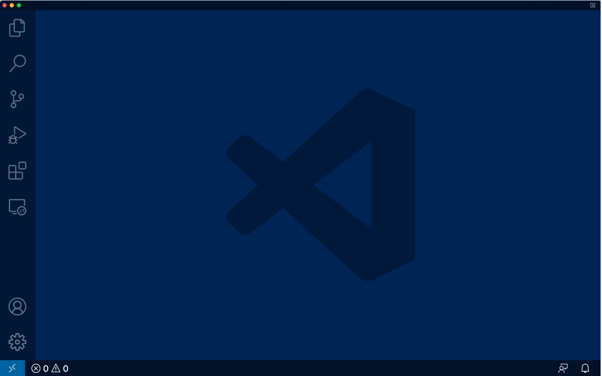

# Lab Report 1 - Week 2 - Mohak Vaswani

In this Lab Report, I am going to describe how we can log onto our course specific account _ieng6_ and run some basic **ssh** and **scp** commands. I am going to be describing 6 steps, with detailed description and screenshots for each step.

## Step 1 - Installing VScode

The first step is Installing VScode. You can download VScode at [this](https://code.visualstudio.com/download) link. 

Clicking the link will redirect you to the page to download VScode as per your operating system requirement.
Once downloaded, install and run VScode, and you should see a basic screen as shown:

