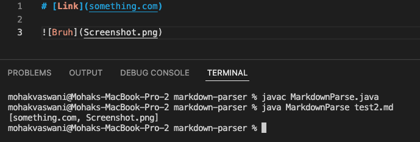

# Lab Report 2 - Week 4 - Mohak Vaswani

In this Lab report, I will be showing three different failure inducing outputs, the code changes I made, and the links to those three code changes

--------------------------------------------------------------------------------------------------------------

## _Failure 1:  Adding an image_

When we tried to add an image into the write-up, the markdown parser would consider the image path/link as a link because the format of adding an image in markdown language is `` and thus algorithm would return "Screenshot.png" as an output as shown here:



Link for the test file is: [test 1](https://github.com/mohakvni/markdown-parser/blob/Lab4-branch/test2.md)

This error occured due to the fact that images use a similar format to link, except with a "!" in front of the opening bracket, which is not read by the algorithm.

I fixed the code by adding an if statement which basically checked if the character right before the opening bracket was an exclaimation mark or not. If it was, it would set the current index to `closeParen + 1` and continue the loop.

Another if statement I added right before the above described if statement was to check whether opening bracket index was 0 because if it would be 0, the index we would use to check if "!" was present would have been -1 giving us a `StringIndexOutOfBoundsException` and crashing the program.

The following lines of code were added:

```
if (openBracket == 0){
    currentIndex = closeParen + 1;
    continue;
    }

if((markdown.charAt(openBracket-1) == ('!'))){
    currentIndex = closeParen + 1;
    continue;
}
```

Adding this code gave us the expected output shown as follows:


The code change is as follows:


The link to the commit is: [Error1-fix](https://github.com/mohakvni/markdown-parser/commit/8c7947caa0bb1158ae679d18bec61005ec513225)

--------------------------------------------------------------------------------------------------------------

## _Failure 2: Only using [] and not () or Only using () and not []_

When we tried using only the `[]` without a `()` in succession, the program crashed. Similarly the program crashed when we try to use only the `()` without a `[]` behind it. The crash shown is as follows:


Link for the test files are: 

[test3](https://github.com/mohakvni/markdown-parser/blob/Lab4-branch/test3.md)

[test4](https://github.com/mohakvni/markdown-parser/blob/Lab4-branch/test4.md)

The reason the program crashed was because
* When we used only `[]` and not `()`, it set the index of the opening parenthesis to be -1, and accessing a string at index -1 would cause the program to crash

* Similarly, when we used only `()` and not `[]`, it set the index of the opening bracket to be -1. As per our previous commit to fix error 1, when we checked if character just before opening bracket is '!', it would then check the character at index -2, causing an `StringIndexOutOfBoundsException`, crashing the program

A fix to the error was that we would check the character before opening bracket and add the link ot the ArrayList only if the indexes of `openBracket`, `closeBracket`, `openParen`, and `closeParen` were not -1. This was done using an if statement to check their index, with an else statement to break the loop if they were -1

Another if statement was added to check if the index of the opening bracket was 0 or not (this was done because if were, then we would check for '!' at index -1, cuasing an exception), and if it were, it would set the current index `closeParen + 1` and continue the loop.

The following piece of code was added:
```
if (openParen != -1 && closeParen != -1 && openBracket!= -1 && closeBracket!=-1){
    ...
}else{
    break;
}
```

Adding this code gave us the expected output shown as follows:


The code change is as follows:


The link to the commit is: [Error2-fix](https://github.com/mohakvni/markdown-parser/commit/b994e5e5080e59142f0e44a9e4653b34587f33b3)

--------------------------------------------------------------------------------------------------------------

## _Failure 3:  What if the opening parenthesis is not after the closing bracket_

If the opening parenthesis is not after the closing bracket, the program should have not have recognized the link between the parenthesis, however it does, as shown here:


A link to the test case is: [test 5](https://github.com/mohakvni/markdown-parser/blob/Lab4-branch/test-file5.md)

The reason this is happening is that while calculating the index, the algorithm jsut checks for the index of the opening parenthesis without checking if the opening parenthsis is actually after the closing bracket or not.

We fix this erorr by adding an if statement that checks if the index of the opening parenthesis is actually after the closing bracket or not. If it is not, it would set the current index `closeParen + 1` and continue the loop.

The following piece of code is added:

```
if(openParen != closeBracket + 1){
    currentIndex = closeParen + 1;
    continue;
}
```

Adding this code gave us the expected output shown as follows:


The code change is as follows:


The link to the commit is: [Error3-fix](https://github.com/mohakvni/markdown-parser/commit/5f1e35d20c34c71d37387db0d7fb8cabb588e1c7)

--------------------------------------------------------------------------------------------------------------