# Lab Report 3 - Week 6 - Mohak Vaswani

In this Lab report, I will be implementing all group choices from Lab 5, providing screenshots and explaining in very brief.

--------------------------------------------------------------------------------------------------------------

## Streamlining ssh Configuration

* _Show your .ssh/config file, and how you edited it (with VScode, another program, etc)_

    So I used **vim** to edit the config file. The screenshot of the vim editor is also shown.

    

    Editing using Vim:

    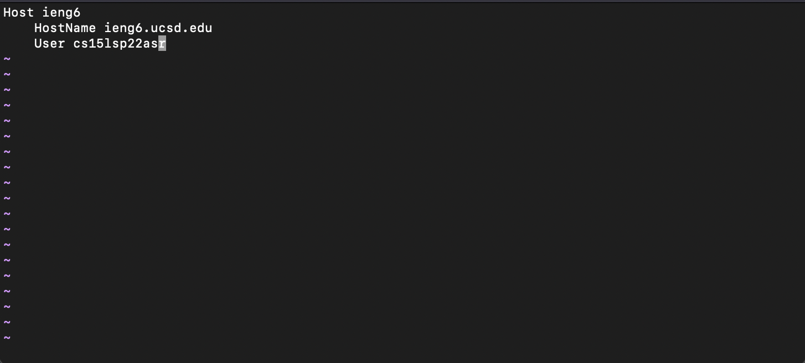

* *Show the ssh command logging you into your account using just
the alias you chose.*

    This image is the same as above one since I edited the config file and logged-in in the same screenshot

    

* *Show an scp command copying a file to your account using just the alias you chose.*

    This is the scp command I used to copy a homework pdf from one of my other classes!

    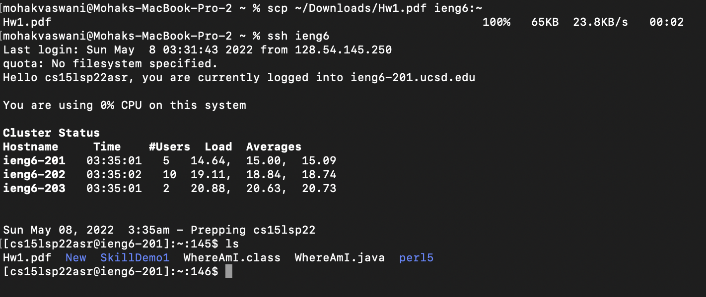

--------------------------------------------------------------------------------------------------------------

## Setup Github Access from ieng6

* _Show where the public key you made is stored on Github and in
your user account (screenshot)._

    This is the location where I have my public key stored on my ieng6 account along with the public key.

    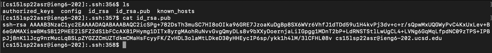

    This is where my ssh key is present on Github.

    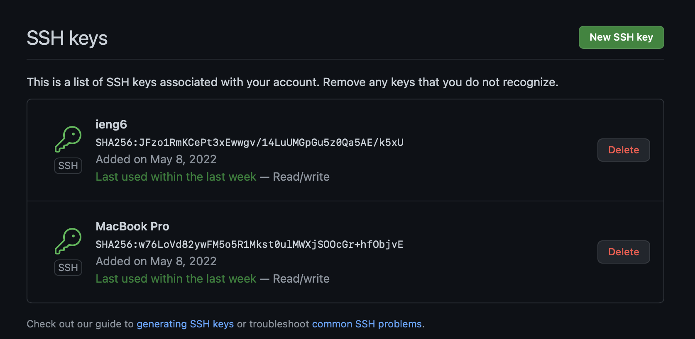
    

* _Show where the private key you made is stored on your user
account (but not its contents) as a screenshot._

    This is the location where I have my private key stored on my ieng6 account.

    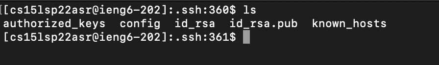

* _Show running `git` commands to commit and push a change to
Github while logged into your ieng6 account._

    This is where I cloned the repo on my ieng6 account, added a new file called `test.md`, committed the changes, and pushed it to origin from my ieng6 account.

    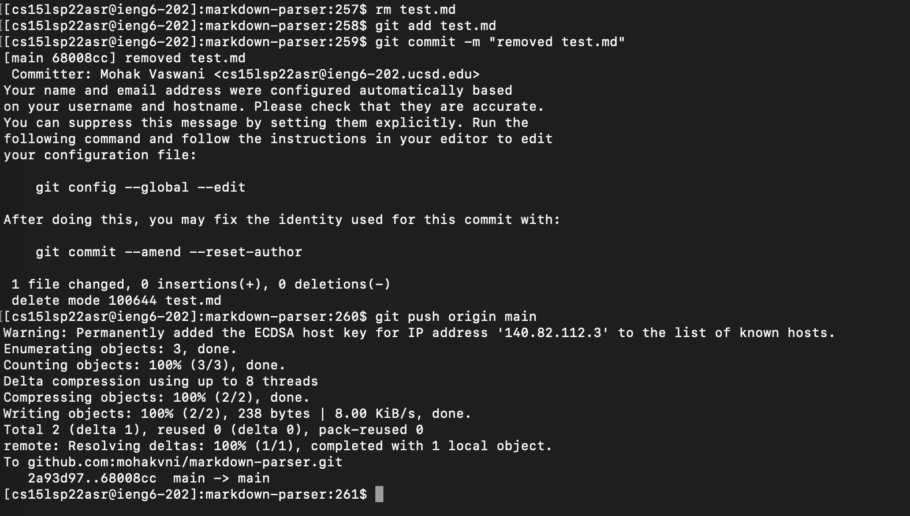

* _Show a link for the resulting commit._

    Following is the link to the commit
    [Github-Commit](https://github.com/mohakvni/markdown-parser/commit/68008ccbb0c79b36824a756292566e1bf5b07ee1)

--------------------------------------------------------------------------------------------------------------

## Copy whole directories with `scp -r`

* _Show copying your whole markdown-parse directory to your ieng6
account._

    Here I `scp`'ed the markdown-parser directory to our remote machine. Since the hidden git files are copied, hence I have divided the copying process in four screenshots.

    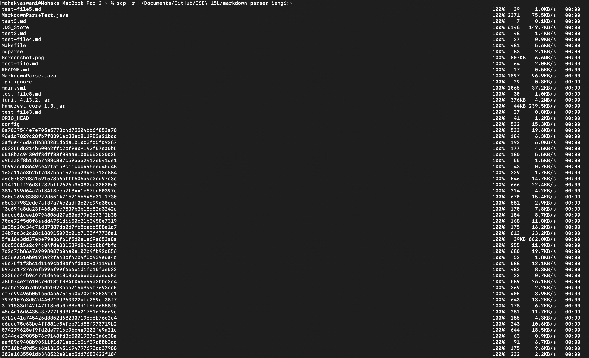

    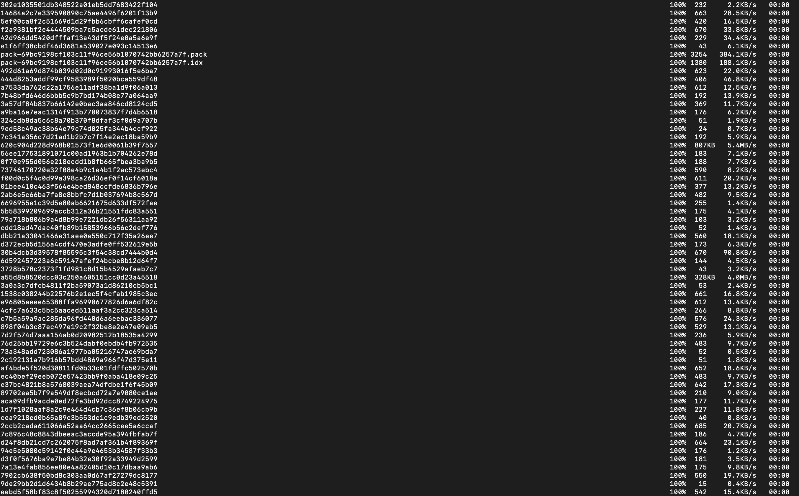

    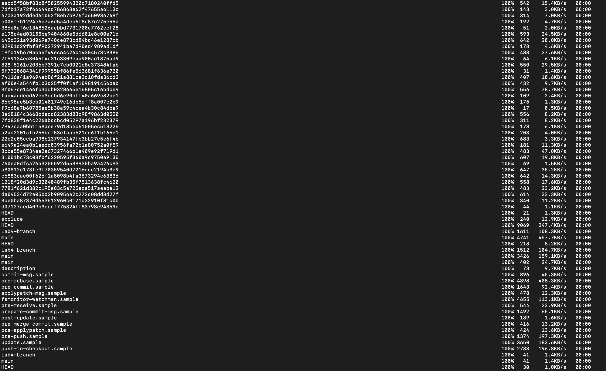

    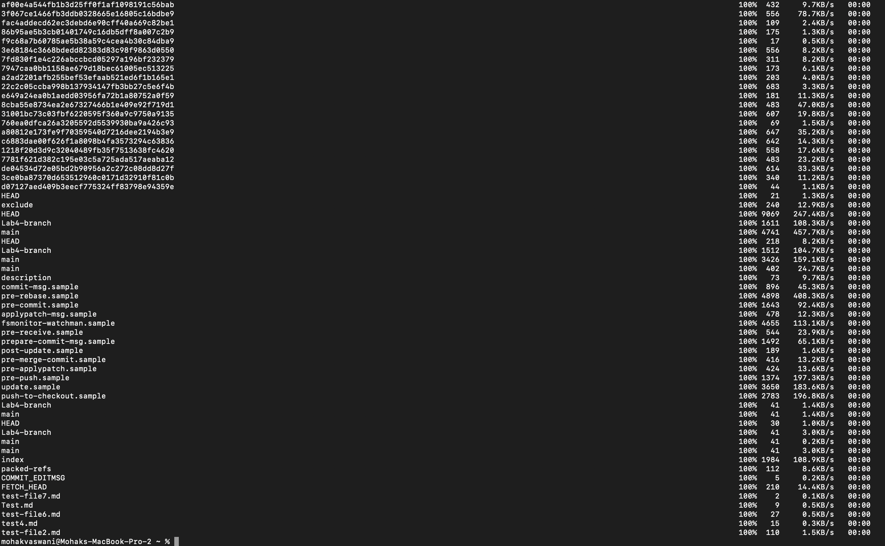

* _Show logging into your ieng6 account after doing this and compiling
and running the tests for your repository._

    Here I ran the tests using my `Makefile` I made in lab 6 and `make test` command.

    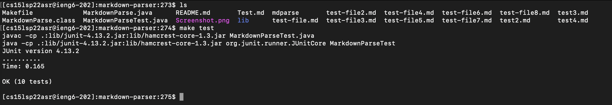

* _Show (like in the last step of the first lab) combining `scp`, `;`, and
`ssh` to copy the whole directory and run the tests in one line._

    Here I used the following command to copy the `markdown-parser` directory, `ssh`'ed into my remote account and ran the tests:

    `scp -r ~/Documents/GitHub/CSE\ 15L/markdown-parser ieng6:~/ ; ssh ieng6 "cd markdown-parser/; make test"`

    Since the screenshots were too long, I just put the start and the end screenshots.

    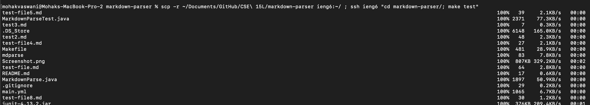

    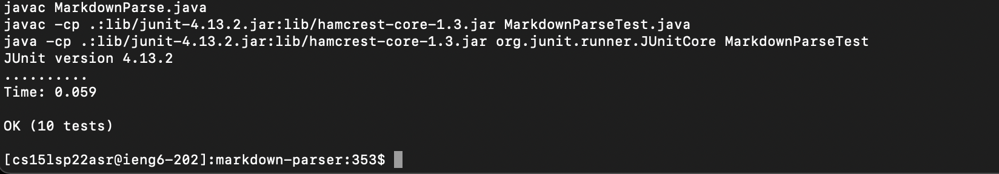