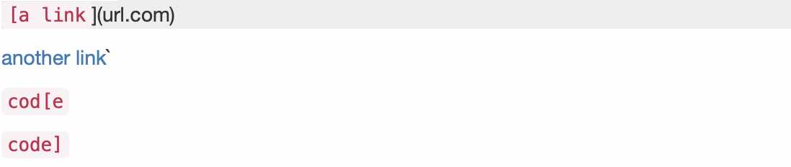
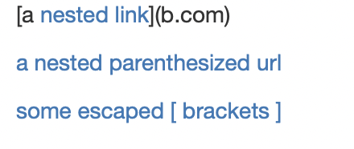
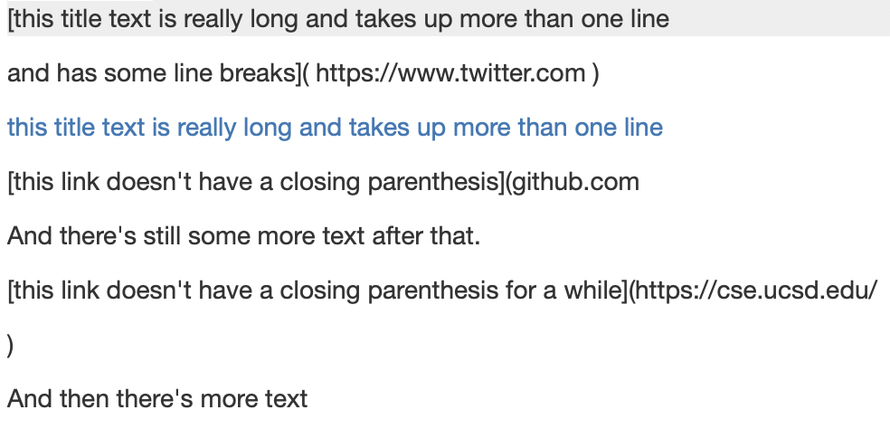

# Lab Report 4 - Week 8 - Mohak Vaswani

In this Lab Report, I will be running 3 different snippets of code as tests for my own version of `MarkdownParse.java` and the version we reviewed in week 7.

--------------------------------------------------------------------------------------------------------------

## Snippet 1

_Expected Output_



The output when this file is used with `MarkdownParse.java` should be:
```
['`google.com','google.com','ucsd.edu']
```

_Code in `MarkdownParseTest.java`_

```
@Test
public void test_snippet1() throws IOException {
    assertEquals(List.of("`google.com", "google.com", "ucsd.edu")
    ,MarkdownParse.getLinks(Files.readString(Path.of("Snippet1.md"))));
}
```

_My Version of `MarkdownParse.java`_

The test failed as we can see below

```
[cs15lsp22asr@ieng6-202]:markdown-parser:419$ make test
javac -cp .:lib/junit-4.13.2.jar:lib/hamcrest-core-1.3.jar MarkdownParseTest.java
java -cp .:lib/junit-4.13.2.jar:lib/hamcrest-core-1.3.jar org.junit.runner.JUnitCore MarkdownParseTest
JUnit version 4.13.2
........E...
Time: 0.021
There was 1 failure:
1) test_snippet1(MarkdownParseTest)
java.lang.AssertionError: expected:<[`google.com, google.com, ucsd.edu]> but was:<[url.com, `google.com, google.com]>
        at org.junit.Assert.fail(Assert.java:89)
        at org.junit.Assert.failNotEquals(Assert.java:835)
        at org.junit.Assert.assertEquals(Assert.java:120)
        at org.junit.Assert.assertEquals(Assert.java:146)
        at MarkdownParseTest.test_snippet1(MarkdownParseTest.java:82)

FAILURES!!!
Tests run: 11,  Failures: 1

make: *** [test] Error 1
```

_Week 7 Version of `MarkdownParse.java`_

```
[cs15lsp22asr@ieng6-202]:markdown-parser:427$ make test
javac -cp .:lib/junit-4.13.2.jar:lib/hamcrest-core-1.3.jar MarkdownParseTest.java
java -cp .:lib/junit-4.13.2.jar:lib/hamcrest-core-1.3.jar org.junit.runner.JUnitCore MarkdownParseTest
JUnit version 4.13.2
...E............
Time: 0.025
There was 1 failure:
1) test_snippet1(MarkdownParseTest)
java.lang.AssertionError: expected:<[`google.com, google.com, ucsd.edu]> but was:<[url.com, `google.com, google.com, ucsd.edu]>
        at org.junit.Assert.fail(Assert.java:89)
        at org.junit.Assert.failNotEquals(Assert.java:835)
        at org.junit.Assert.assertEquals(Assert.java:120)
        at org.junit.Assert.assertEquals(Assert.java:146)
        at MarkdownParseTest.test_snippet1(MarkdownParseTest.java:95)

FAILURES!!!
Tests run: 15,  Failures: 1

make: *** [test] Error 1
```

--------------------------------------------------------------------------------------------------------------

## Snippet 2

_Expected Output_



The output when this file is used with `MarkdownParse.java` should be:
```
["a.com", "a.com(())", "example.com"]
```

_Code in `MarkdownParseTest.java`_

```
@Test
public void test_snippet2() throws IOException {
    assertEquals(List.of("a.com", "a.com(())", "example.com")
    ,MarkdownParse.getLinks(Files.readString(Path.of("Snippet2.md"))));
}
```

_My Version of `MarkdownParse.java`_

```
[cs15lsp22asr@ieng6-202]:markdown-parser:420$ make test
javac -cp .:lib/junit-4.13.2.jar:lib/hamcrest-core-1.3.jar MarkdownParseTest.java
java -cp .:lib/junit-4.13.2.jar:lib/hamcrest-core-1.3.jar org.junit.runner.JUnitCore MarkdownParseTest
JUnit version 4.13.2
........E...
Time: 0.039
There was 1 failure:
1) test_snippet2(MarkdownParseTest)
java.lang.AssertionError: expected:<[a.com, a.com(()), example.com]> but was:<[a.com((]>
        at org.junit.Assert.fail(Assert.java:89)
        at org.junit.Assert.failNotEquals(Assert.java:835)
        at org.junit.Assert.assertEquals(Assert.java:120)
        at org.junit.Assert.assertEquals(Assert.java:146)
        at MarkdownParseTest.test_snippet2(MarkdownParseTest.java:88)

FAILURES!!!
Tests run: 11,  Failures: 1

make: *** [test] Error 1
```

_Week 7 Version of `MarkdownParse.java`_

```
cs15lsp22asr@ieng6-202]:markdown-parser:436$ make test
javac -cp .:lib/junit-4.13.2.jar:lib/hamcrest-core-1.3.jar MarkdownParseTest.java
java -cp .:lib/junit-4.13.2.jar:lib/hamcrest-core-1.3.jar org.junit.runner.JUnitCore MarkdownParseTest
JUnit version 4.13.2
...E............
Time: 0.027
There was 1 failure:
1) test_snippet2(MarkdownParseTest)
java.lang.AssertionError: expected:<[a.com, a.com(()), example.com]> but was:<[a.com, b.com, a.com(()), example.com]>
        at org.junit.Assert.fail(Assert.java:89)
        at org.junit.Assert.failNotEquals(Assert.java:835)
        at org.junit.Assert.assertEquals(Assert.java:120)
        at org.junit.Assert.assertEquals(Assert.java:146)
        at MarkdownParseTest.test_snippet2(MarkdownParseTest.java:101)

FAILURES!!!
Tests run: 15,  Failures: 1

make: *** [test] Error 1
```

--------------------------------------------------------------------------------------------------------------

## Snippet 3

_Expected Output_



The output when this file is used with `MarkdownParse.java` should be:
```
["https://sites.google.com/eng.ucsd.edu/cse-15l-spring-2022/schedule"]
```

_Code in `MarkdownParseTest.java`_

```
@Test
public void test_snippet3() throws IOException {
    assertEquals(List.of("https://sites.google.com/eng.ucsd.edu/cse-15l-spring-2022/schedule")
    ,MarkdownParse.getLinks(Files.readString(Path.of("Snippet3.md"))));
}
```

_My Version of `MarkdownParse.java`_

```
[cs15lsp22asr@ieng6-202]:markdown-parser:420$ make test
javac -cp .:lib/junit-4.13.2.jar:lib/hamcrest-core-1.3.jar MarkdownParseTest.java
java -cp .:lib/junit-4.13.2.jar:lib/hamcrest-core-1.3.jar org.junit.runner.JUnitCore MarkdownParseTest
JUnit version 4.13.2
........E...
Time: 0.022
There was 1 failure:
1) test_snippet3(MarkdownParseTest)
java.lang.AssertionError: expected:<[https://sites.google.com/eng.ucsd.edu/cse-15l-spring-2022/schedule]> but was:<[
https://sites.google.com/eng.ucsd.edu/cse-15l-spring-2022/schedule
, github.com

And there's still some more text after that.

[this link doesn't have a closing parenthesis for a while](https://cse.ucsd.edu/


]>
        at org.junit.Assert.fail(Assert.java:89)
        at org.junit.Assert.failNotEquals(Assert.java:835)
        at org.junit.Assert.assertEquals(Assert.java:120)
        at org.junit.Assert.assertEquals(Assert.java:146)
        at MarkdownParseTest.test_snippet3(MarkdownParseTest.java:94)

FAILURES!!!
Tests run: 11,  Failures: 1

make: *** [test] Error 1
```

_Week 7 Version of `MarkdownParse.java`_

```
[cs15lsp22asr@ieng6-202]:markdown-parser:429$ make test
javac -cp .:lib/junit-4.13.2.jar:lib/hamcrest-core-1.3.jar MarkdownParseTest.java
java -cp .:lib/junit-4.13.2.jar:lib/hamcrest-core-1.3.jar org.junit.runner.JUnitCore MarkdownParseTest
JUnit version 4.13.2
...E............
Time: 0.021
There was 1 failure:
1) test_snippet3(MarkdownParseTest)
java.lang.AssertionError: expected:<[https://sites.google.com/eng.ucsd.edu/cse-15l-spring-2022/schedule]> but was:<[
https://www.twitter.com
, 
https://sites.google.com/eng.ucsd.edu/cse-15l-spring-2022/schedu
le
, https://cse.ucsd.edu/
]>
        at org.junit.Assert.fail(Assert.java:89)
        at org.junit.Assert.failNotEquals(Assert.java:835)
        at org.junit.Assert.assertEquals(Assert.java:120)
        at org.junit.Assert.assertEquals(Assert.java:146)
        at MarkdownParseTest.test_snippet3(MarkdownParseTest.java:107)

FAILURES!!!
Tests run: 15,  Failures: 1

make: *** [test] Error 1
```

--------------------------------------------------------------------------------------------------------------

_Question 1_

A possible solution to this issue is to corss check for backticks whereever possible. This can be done by checking if the backtick is present and then finding its closing backtick to consider the link between it. If the backtick is not present, ignore it. This can be done with'in 10 lines.

_Question 2_

A possible solution to this issue is to find nested parenthesis whereever possible by using the stack approach taught to us in CSE-12. However, this approach can take more than 10 lines of code as we have to find the opening parenthesis, push to the stack and try and find a matching closing parenthesis, popping it when we find it.

_Question 3_

A possible solution to this issue could be to write the code so that it finds the next matching parenthesis/bracket even if its present in the next line rather than assuming they are in the same line. We can also check for new lines with'n the link themselves, and not consider the link as a whole if multiple of these newlines are present. This can be done with'in 10 lines.