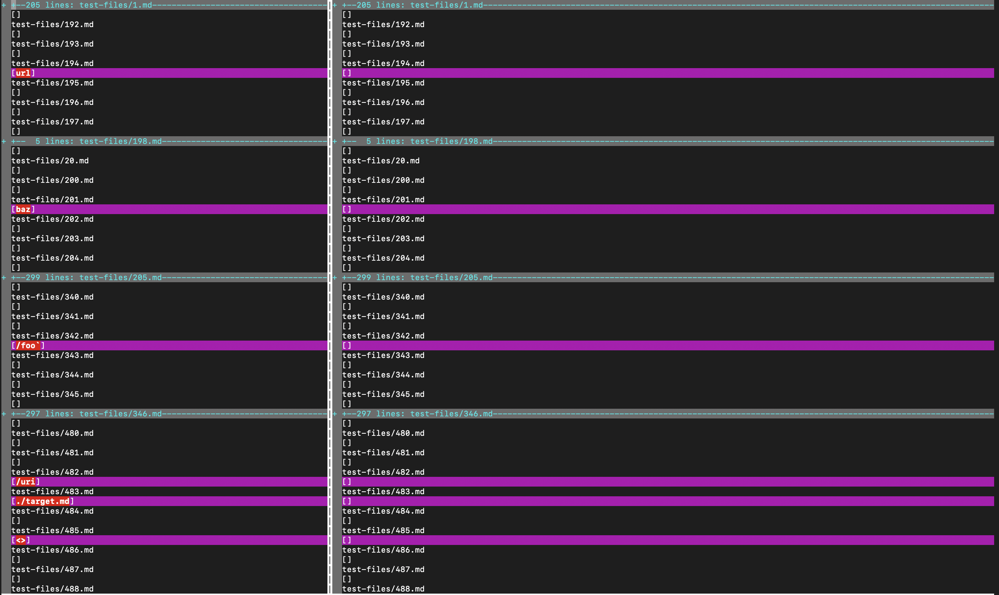
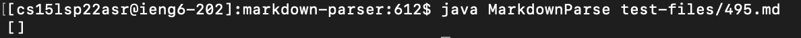
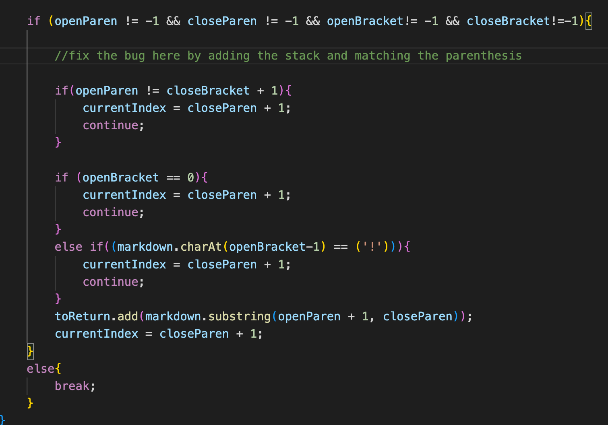
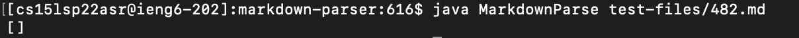
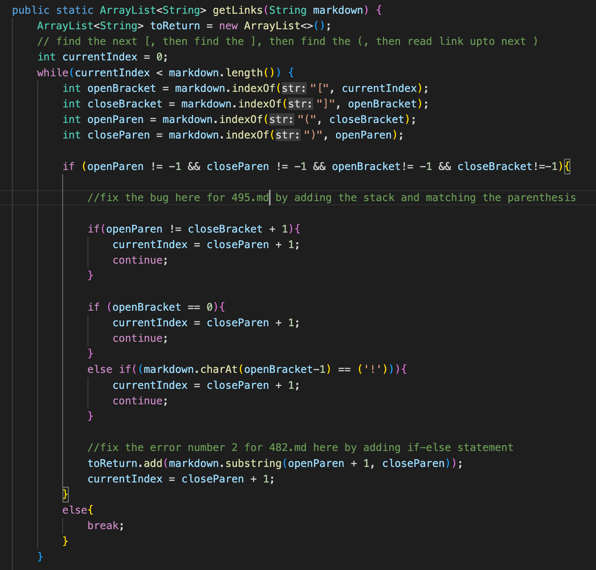

# Lab Report 5 - Week 10 - Mohak Vaswani

In this Lab report, I will be taking taking two different tests from the 652 tests given to us, comparing them, and trying to figure out what is wrong and how to fix it.

---

## How did I find the different results

First I ran `script.sh` with week-9 version of markdown-parser and directed the results to a file called `results.txt`. Then I ran `script.sh` on my version of Markdown-parser and directed the results to `myresults.txt`. To compare, I used `vimdiff` as shown here:

Code Used :

```
vimdiff markdown-parser_week9/results.txt markdown-parser/myresults.txt
```

Output generated:



Here the two files we will be choosing are 

[495.md](https://github.com/nidhidhamnani/markdown-parser/blob/main/test-files/495.md)

[482.md](https://github.com/nidhidhamnani/markdown-parser/blob/main/test-files/482.md)

---

## Test File 1

So we are going to be looking at `495.md` for our first test file.

For our case, the week 9 version of markdown-parser is correct but not mine as the expected output from commonmark should be:

`[foo(and(bar))]`

The actual output for my version of markdown-parser is :



_Bug identificaton and probable fixes_

The bug is that in my code, since there are multiple parenthesis in the main parenthesis, my code is unable to match them together and hence fails to identify the link. 

A potential fix is to make a stack and add the opening parenthesis, and constantly pop it and try match it with closing parenthesis. If at the end, the stack is empty, then all parenthesis is matched and link is found. 

We can make the change in the getLinks method as shown here:



---

## Test File 2

So we are going to be looking at `482.md` for our first test file.

For our case, the week 9 version of markdown-parser is correct but not mine as the expected output from commonmark should be:

`[/uri]`

The actual output for my version of markdown-parser is :



_Bug identificaton and probable fixes_

The bug is that in my code, since there is a `/` in front of the `uri`, it is unable to identify the special character and hence the link

A potential fix is to identify a special character such as `/` as another if-else statement.

We can make the change in the getLinks method as shown here:



